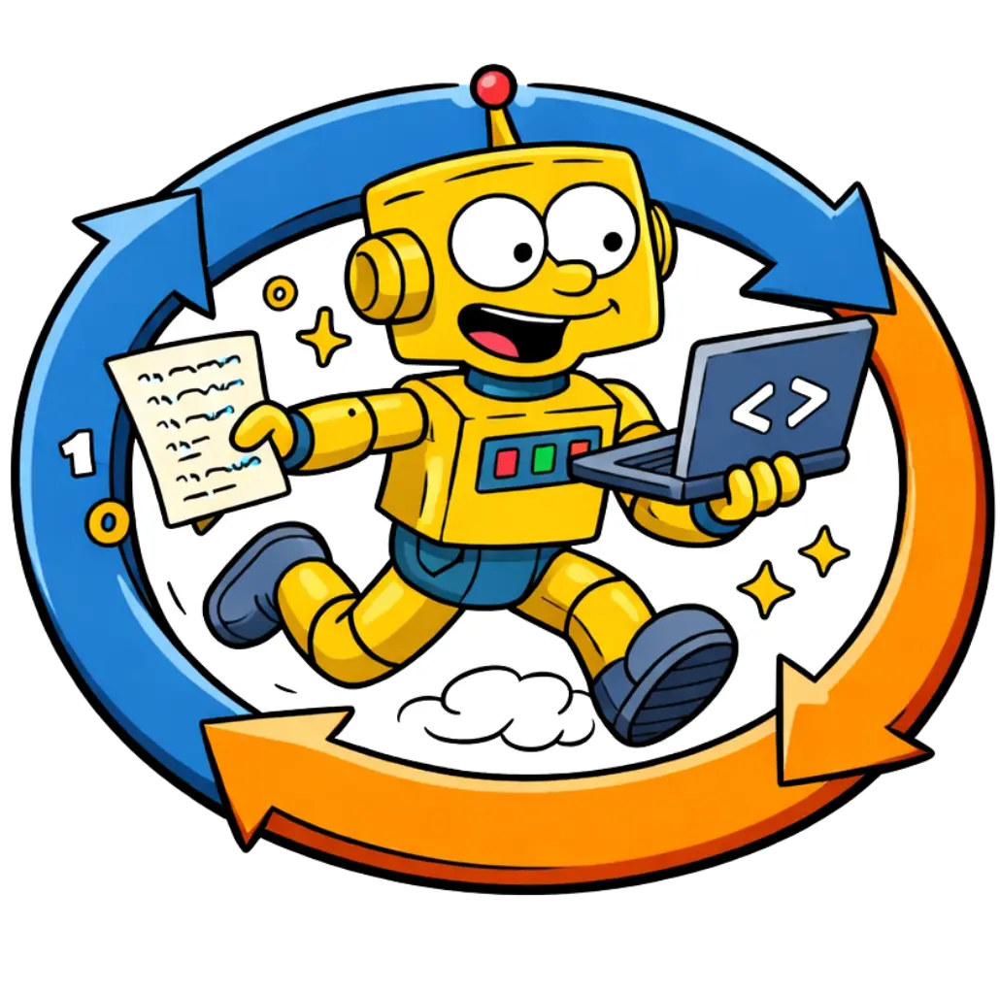

# Ralph

Codex agent loop-runner that works through a PRD backlog.

<p align="center">
  
</p>

## What’s here

- `prd.json` — story backlog with priorities and acceptance criteria.
- `progress.txt` — running log of completed steps and results.
- `prompt.md` — operating rules for the Ralph loop.
- `loop.sh` — helper script to run the loop.

## Setup

- Copy `ralph` folder from this repo into your project
- [Codex CLI](https://developers.openai.com/codex/cli/)
- Add a skill to Codex to convert natural language into PRD entries:
  ```sh
  mkdir -p ~/.codex/skills/to-prd && cp ralph/to-prd.skill.json ~/.codex/skills/to-prd/
  ```

## Usage

- open `codex` and submit `$to-prd your feature idea here`
- codex will add the PRD entry to `prd.json`
- run `sh ralph/loop.sh` to process the next item in the backlog

> **Inspired by [Geoffrey Huntley](https://ghuntley.com/ralph/)**,
> thanks!
